# Execution Plan - 테이블오더 서비스

## Detailed Analysis Summary

### Change Impact Assessment
- **User-facing changes**: Yes - 완전히 새로운 고객/관리자 웹 인터페이스
- **Structural changes**: Yes - 새 시스템 아키텍처 (Next.js + FastAPI + PostgreSQL)
- **Data model changes**: Yes - 전체 데이터 모델 신규 설계 필요 (Store, Table, Menu, Order, Category, User 등)
- **API changes**: Yes - 전체 REST API 신규 설계 필요
- **NFR impact**: Yes - SSE 실시간 통신, JWT 인증, 이미지 업로드

### Risk Assessment
- **Risk Level**: Medium - 새 프로젝트이므로 기존 시스템 영향 없음, 기술 스택은 성숙하지만 범위가 넓음
- **Rollback Complexity**: Easy - Greenfield, 기존 시스템 없음
- **Testing Complexity**: Moderate - SSE 실시간 통신, 멀티테넌트 데이터 격리 검증 필요

---

## Workflow Visualization

```mermaid
flowchart TD
    Start(["User Request"])

    subgraph INCEPTION["INCEPTION PHASE"]
        WD["Workspace Detection<br/><b>COMPLETED</b>"]
        RA["Requirements Analysis<br/><b>COMPLETED</b>"]
        US["User Stories<br/><b>COMPLETED</b>"]
        WP["Workflow Planning<br/><b>COMPLETED</b>"]
        AD["Application Design<br/><b>EXECUTE</b>"]
        UG["Units Generation<br/><b>EXECUTE</b>"]
    end

    subgraph CONSTRUCTION["CONSTRUCTION PHASE"]
        FD["Functional Design<br/><b>EXECUTE</b>"]
        NFRA["NFR Requirements<br/><b>EXECUTE</b>"]
        NFRD["NFR Design<br/><b>EXECUTE</b>"]
        ID["Infrastructure Design<br/><b>EXECUTE</b>"]
        CG["Code Generation<br/><b>EXECUTE</b>"]
        BT["Build and Test<br/><b>EXECUTE</b>"]
    end

    Start --> WD
    WD --> RA
    RA --> US
    US --> WP
    WP --> AD
    AD --> UG
    UG --> FD
    FD --> NFRA
    NFRA --> NFRD
    NFRD --> ID
    ID --> CG
    CG --> BT
    BT --> End(["Complete"])

    style WD fill:#4CAF50,stroke:#1B5E20,stroke-width:3px,color:#fff
    style RA fill:#4CAF50,stroke:#1B5E20,stroke-width:3px,color:#fff
    style US fill:#4CAF50,stroke:#1B5E20,stroke-width:3px,color:#fff
    style WP fill:#4CAF50,stroke:#1B5E20,stroke-width:3px,color:#fff
    style AD fill:#FFA726,stroke:#E65100,stroke-width:3px,stroke-dasharray: 5 5,color:#000
    style UG fill:#FFA726,stroke:#E65100,stroke-width:3px,stroke-dasharray: 5 5,color:#000
    style FD fill:#FFA726,stroke:#E65100,stroke-width:3px,stroke-dasharray: 5 5,color:#000
    style NFRA fill:#FFA726,stroke:#E65100,stroke-width:3px,stroke-dasharray: 5 5,color:#000
    style NFRD fill:#FFA726,stroke:#E65100,stroke-width:3px,stroke-dasharray: 5 5,color:#000
    style ID fill:#FFA726,stroke:#E65100,stroke-width:3px,stroke-dasharray: 5 5,color:#000
    style CG fill:#4CAF50,stroke:#1B5E20,stroke-width:3px,color:#fff
    style BT fill:#4CAF50,stroke:#1B5E20,stroke-width:3px,color:#fff
    style INCEPTION fill:#BBDEFB,stroke:#1565C0,stroke-width:3px,color:#000
    style CONSTRUCTION fill:#C8E6C9,stroke:#2E7D32,stroke-width:3px,color:#000
    style Start fill:#CE93D8,stroke:#6A1B9A,stroke-width:3px,color:#000
    style End fill:#CE93D8,stroke:#6A1B9A,stroke-width:3px,color:#000
    linkStyle default stroke:#333,stroke-width:2px
```



### Text Alternative
```
INCEPTION PHASE:
  1. Workspace Detection    - COMPLETED
  2. Requirements Analysis  - COMPLETED
  3. User Stories           - COMPLETED
  4. Workflow Planning      - COMPLETED
  5. Application Design    - EXECUTE
  6. Units Generation      - EXECUTE

CONSTRUCTION PHASE:
  7. Functional Design      - EXECUTE (per-unit)
  8. NFR Requirements       - EXECUTE (per-unit)
  9. NFR Design             - EXECUTE (per-unit)
  10. Infrastructure Design - EXECUTE (per-unit)
  11. Code Generation       - EXECUTE (per-unit)
  12. Build and Test        - EXECUTE
```

---

## Phases to Execute

### INCEPTION PHASE
- [x] Workspace Detection (COMPLETED)
- [x] Requirements Analysis (COMPLETED)
- [x] User Stories (COMPLETED)
- [x] Workflow Planning (COMPLETED)
- [ ] Application Design - **EXECUTE**
  - **Rationale**: 전체 컴포넌트 식별, 서비스 레이어 설계, 컴포넌트 간 의존성 정의가 필요함. 새 시스템이므로 고수준 아키텍처 결정이 중요.
- [ ] Units Generation - **EXECUTE**
  - **Rationale**: 복잡한 시스템(프론트엔드, 백엔드 API, DB 스키마, 이미지 업로드, SSE)을 구조화된 유닛으로 분해하여 순차적 구현 필요.

### CONSTRUCTION PHASE (per-unit)
- [ ] Functional Design - **EXECUTE**
  - **Rationale**: 새 데이터 모델(Store, Table, Menu, Order, Category, User, Session), 복잡한 비즈니스 로직(테이블 세션 라이프사이클, 주문 상태 관리, 멀티테넌트 데이터 격리) 설계 필요.
- [ ] NFR Requirements - **EXECUTE**
  - **Rationale**: 성능(SSE 2초 이내), 인증(JWT, bcrypt), 실시간 통신, 이미지 업로드, 멀티테넌트 데이터 격리 등 NFR 상세 분석 필요. 사용자 요청으로 추가.
- [ ] NFR Design - **EXECUTE**
  - **Rationale**: NFR Requirements 결과를 기반으로 NFR 패턴 설계 필요. 사용자 요청으로 추가.
- [ ] Infrastructure Design - **EXECUTE**
  - **Rationale**: Docker 컨테이너 배포 아키텍처(프론트엔드/백엔드/DB 컨테이너), docker-compose 설계, 이미지 저장소 구성 필요.
- [ ] Code Generation - **EXECUTE** (ALWAYS)
  - **Rationale**: 구현 필수.
- [ ] Build and Test - **EXECUTE** (ALWAYS)
  - **Rationale**: 빌드/테스트 지침 필수.

---

## Success Criteria
- **Primary Goal**: 고객 주문 + 관리자 모니터링이 가능한 테이블오더 MVP 완성
- **Key Deliverables**:
  - Next.js 프론트엔드 (고객/관리자 경로 분리)
  - FastAPI 백엔드 (REST API + SSE)
  - PostgreSQL 데이터베이스 스키마
  - Docker Compose 배포 설정
- **Quality Gates**:
  - 전체 API 엔드포인트 동작
  - SSE 실시간 주문 업데이트 동작
  - 멀티테넌트 데이터 격리 확인
  - 테이블 세션 라이프사이클 동작
